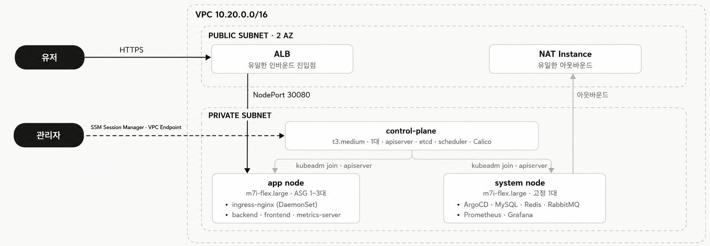
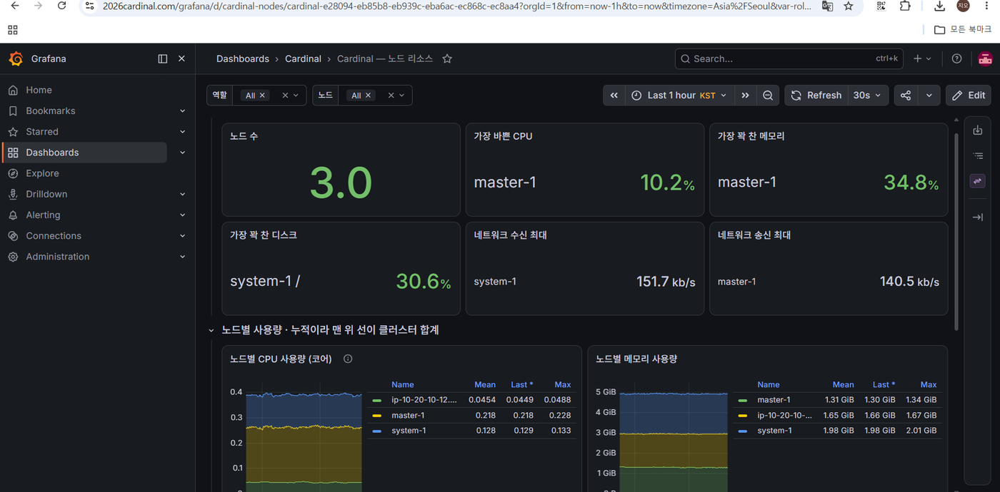
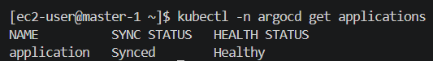
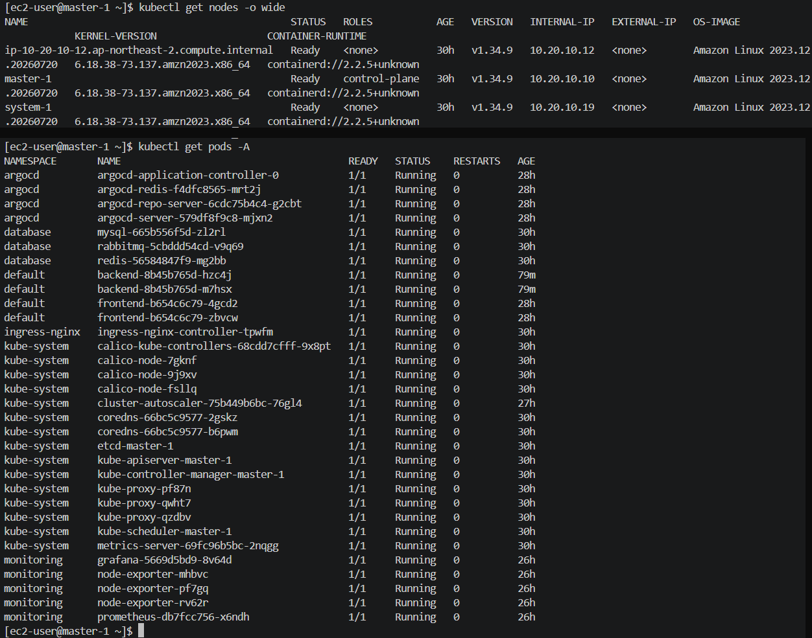

# 서강대학교 대동제 Cardinal 아키텍처 설계

> 축제 기간의 트래픽 급증을 예산 30만 원 안에서 견뎌내기 위해, 가용성·안정성·현실성을 조율한 Kubernetes 클라우드 인프라 아키텍처 설계.

멋쟁이사자처럼 서강대 × 총동아리연합회 협업 프로젝트인 **대동제 웹서비스**의 인프라 저장소입니다.
서강대생뿐 아니라 일반 사용자도 접근하는 서비스라, **제한된 예산 안에서 안정성과 비용 효율을 동시에 확보하는 것**을 목표로 했습니다.

| 구분 | 사용 기술 |
|---|---|
| **IaC** | Terraform (모듈 10개 · 로컬 state) |
| **오케스트레이션** | kubeadm `v1.34.9` · containerd · Calico |
| **AWS** | VPC · Public/Private Subnet · EC2 · ASG · EBS · ALB · Route 53 · ACM · S3 |
| **배포 · staging** | GitHub Actions → GHCR → Watchtower(단일 EC2 · Docker Compose · nginx + certbot) |
| **배포 · prod** | GitHub Actions → GHCR → ArgoCD(GitOps) · ingress-nginx · HPA + Cluster Autoscaler |
| **관측** | Prometheus · Grafana · node-exporter |

---

## 목차

1. [아키텍처 설계 구조](#1-아키텍처-설계-구조)
2. [트레이드오프](#2-트레이드오프)
3. [트러블슈팅](#3-트러블슈팅)
4. [결과 사진](#4-결과-사진)
5. [결과](#5-결과)

---

## 1. 아키텍처 설계 구조



### 출발점

이 프로젝트의 첫 목적은 Terraform과 Ansible로 쿠버네티스 클러스터를 세우는 구성을 실제 서비스에 적용해 보는 것이었습니다.

- [sohappytoday/terraform-aws](https://github.com/sohappytoday/terraform-aws) — Terraform으로 AWS 인프라 프로비저닝
- [sohappytoday/ansible](https://github.com/sohappytoday/ansible) — Ansible로 쿠버네티스 클러스터 구성

여기서 한 단계 올린 아키텍처를 이 저장소에 작성했습니다.
학습용 구성과 실제 서비스의 차이는 결국 예산·트래픽·장애라는 제약이었고, 아래 설계는 대부분 그 제약에 대한 답입니다.
특히 노드 구성은 부팅 시점에 Ansible이 개입할 수 없는 오토스케일링 환경에 맞춰, Custom AMI + 부트스트랩 자동화로 다시 짰습니다.

### 클라우드 아키텍처

**진입점을 ALB 하나로 좁혔다.**
인바운드는 ALB 80/443만 열리고, 그 뒤의 모든 노드는 Private Subnet에 있어 퍼블릭 IP가 없습니다.
TLS는 ACM 인증서로 ALB에서 종료하고 노드로는 평문 NodePort 30080으로 넘깁니다. 인증서 갱신을 클러스터가 신경 쓰지 않아도 되고,
공격 표면이 ALB 한 곳으로 모이기 때문에 방어(NACL deny · Access Log 분석)도 한 곳에서 합니다.
ALB는 생성 자체가 서로 다른 AZ의 서브넷 2개를 요구하므로 서브넷은 2 AZ로 깔되, EC2는 비용을 위해 한 AZ에 모았습니다.
ALB의 cross-zone 로드밸런싱은 기본으로 켜져 있고 무료라 다른 AZ의 ALB 노드가 타겟으로 넘겨도 추가 비용이 없습니다.

**Reverse Proxy EC2를 ALB로 바꿔 진입점의 안정성을 올렸다.**
앞선 구성(그리고 지금의 staging)에서는 nginx를 올린 EC2 한 대가 리버스 프록시 역할을 했습니다.
이 방식은 그 인스턴스가 죽으면 서비스 전체가 같이 죽고, 인증서 갱신도 노드 추가도 사람이 직접 챙겨야 합니다.
prod에서는 그 자리를 ALB로 바꿨습니다 — AWS가 관리하는 다중 AZ 구성이라 인스턴스 단위 장애가 사라지고,
TLS는 ACM으로 자동 갱신되며, 헬스체크에 실패한 노드는 자동으로 타겟에서 빠집니다.

**도메인은 Route 53을 쓸 수밖에 없었다.**
도메인은 가비아에서 샀지만 DNS는 Route 53에 있습니다. ALB는 고정 IP가 없어 A 레코드로 직접 가리킬 수 없고,
도메인 루트(`2026cardinal.com`)에 붙이려면 Alias A 레코드가 필요한데 이건 Route 53에서만 만들 수 있습니다.
그래서 Hosted Zone을 만들고 가비아 네임서버를 Route 53의 NS 4개로 바꿨습니다. ACM 인증서의 DNS 검증도 같은 Zone에서 처리됩니다.

**아웃바운드는 NAT Instance 하나로 좁혔다.**
Private 노드도 이미지 pull 같은 아웃바운드가 필요합니다. 관리형 NAT Gateway는 월 7만 원 수준이라 예산에 맞지 않아,
`source_dest_check = false` + `iptables MASQUERADE`로 직접 만든 NAT Instance를 씁니다.
1대라 SPOF가 되므로 size-1 ASG로 감싸 죽으면 자동으로 다시 뜨게 하고, S3·ECR 트래픽은 무료인 S3 Gateway Endpoint로 NAT를 우회시켰습니다.

**ASG는 정반대의 두 목적으로 썼다 — 확장, 그리고 자기 치유.**
App 노드 ASG(`min 1` / `max 3`)는 Cluster Autoscaler가 부하에 따라 크기를 바꾸는 확장용입니다.
반면 NAT를 감싼 ASG는 `min = max = 1`로 고정해 크기를 절대 바꾸지 않습니다 — 목적이 확장이 아니라 죽으면 다시 띄우는 자기 치유이기 때문입니다.
같은 리소스를 반대 의도로 쓴 셈이지만, 둘 다 목적은 하나입니다. 사람이 새벽에 깨서 인스턴스를 다시 만들지 않는 것.
ASG에 Target Group ARN을 연결해 두면 스케일아웃된 노드가 별도 작업 없이 ALB 뒤에 등록됩니다.

**관리자 경로에는 인바운드 포트를 열지 않았다.**
Control Plane에는 SSH 포트조차 없습니다. 관리자는 SSM Session Manager로 VPC Interface Endpoint를 거쳐 들어옵니다.
Bastion 인스턴스 비용과 열린 22번 포트를 동시에 없애기 위한 선택입니다.

### 리소스 아키텍처

**노드를 역할로 3등분했다.**

| 노드 | 스펙 | 올라가는 것 | 이렇게 나눈 이유 |
|---|---|---|---|
| control-plane | `t3.medium` × 1 | apiserver · etcd · scheduler · Calico | 예산상 정족수 HA를 포기한 대신, etcd 스냅샷을 S3에 정기 백업 |
| system node | `m7i-flex.large` × 1 (고정) | ArgoCD · MySQL · Redis · RabbitMQ · Prometheus · Grafana | **상태를 가진 것을 ASG 밖으로 뺐다.** ASG Scale-In과 Cluster Autoscaler는 파드를 모른 채 노드를 고르므로, MySQL이 ASG 안에 있으면 하필 그 노드가 죽을 수 있다 |
| app node | `m7i-flex.large` × ASG 1~3 | ingress-nginx(DaemonSet) · backend · frontend · metrics-server | 사용자 워크로드만 확장 대상. HPA(파드) → Cluster Autoscaler(노드) 순으로 늘어난다 |

구분은 kubelet이 등록 시 스스로 붙이는 `cardinal.io/role` 노드 라벨로 합니다.
세 모듈이 같은 키를 쓰기 때문에 node-exporter DaemonSet은 Control Plane까지 한 번에 잡고,
값이 서로 달라 Prometheus·ArgoCD·ingress의 `nodeSelector`가 다른 역할로 새어 들어가지 않습니다.

**스케일아웃 노드가 스스로 클러스터에 붙게 했다.**
ASG로 새로 뜬 EC2는 쿠버네티스가 없어 클러스터에 못 붙습니다. 부하가 몰리는 순간에 Ansible로 설치하는 건 너무 늦습니다.
그래서 kubeadm·kubelet·containerd를 미리 구운 Custom AMI를 쓰고, Control Plane이 유효한 join 커맨드를
SSM Parameter Store에 6시간마다 갱신해두면 신규 노드가 부팅하며 그것을 받아 `kubeadm join`합니다.
기본 부트스트랩 토큰 TTL이 24시간이라, 갱신이 없으면 축제 도중 스케일아웃이 조용히 실패합니다.

**ingress-nginx는 Deployment가 아니라 DaemonSet으로 띄웠다.**
ALB가 NodePort 30080으로 넘긴 요청을 받아 경로별로 서비스에 배분하는 L7 라우터입니다.
ALB는 파드가 아니라 노드 단위로 타겟을 잡기 때문에, 컨트롤러가 없는 노드가 타겟에 끼면 헬스체크에 실패하거나 노드를 한 번 더 건너뛰게 됩니다.
모든 app 노드에 하나씩 두면 ASG가 노드를 늘리는 즉시 그 노드가 정상 타겟이 됩니다.

**metrics-server는 HPA의 전제 조건이다.**
쿠버네티스는 기본적으로 파드가 CPU·메모리를 얼마나 쓰는지 모릅니다.
metrics-server가 각 kubelet에서 사용량을 모아 `metrics.k8s.io` API로 노출해야 HPA가 그 값을 읽고 레플리카 수를 정할 수 있습니다(`kubectl top`도 같은 API를 씁니다).
HPA(2~6) → Cluster Autoscaler → ASG로 이어지는 확장 사슬의 첫 단추라, 이게 없으면 뒤의 자동화가 전부 멈춥니다.

**ArgoCD로 배포를 git에 묶었다.**
이 저장소의 `manifest/` 디렉토리가 곧 클러스터의 상태 정의이고, ArgoCD가 git과 실제 클러스터의 차이를 계속 비교해 맞춥니다.
사람이 `kubectl apply`를 직접 치지 않으니 누가 무엇을 바꿨는지가 git 히스토리에 남고, 급해서 손으로 고친 것도 결국 원래 정의로 되돌아옵니다.
축제처럼 여러 사람이 동시에 붙는 기간에는 이 되돌림 자체가 사고 예방입니다. 확장할 이유가 없는 도구라 system 노드에 고정했습니다.

**MySQL은 RDS를 쓰지 않고 클러스터 안에 뒀다.**
RDS는 이 예산에서 가장 큰 고정비 중 하나이고 Multi-AZ를 켜면 두 배가 됩니다. 그래서 클러스터 안의 파드로 직접 운영합니다.
포기한 것은 명확합니다 — 자동 백업·페일오버·패치가 전부 사라지고, 그 자리를 mysqldump CronJob이 대신합니다.
대신 확장하지 않는 system 노드와 정적 EBS(`/mnt/data/mysql`)에 hostPath로 묶어, 오토스케일링 이벤트가 데이터에 닿지 않게 했습니다.
파드가 특정 노드에 종속되는 대가를 치르고 데이터 안전을 산 셈입니다.

**Prometheus·Grafana는 CloudWatch 대신 직접 운영한다.**
HPA가 보는 것과 같은 파드 단위 지표가 필요했고, CloudWatch Container Insights는 수집량에 비례해 요금이 붙어 예산을 예측하기 어렵습니다.
node-exporter를 DaemonSet으로 세 역할 노드 전부(toleration을 달아 Control Plane까지)에 띄우고, Grafana에서 역할별 토글로 노드·파드 CPU·메모리를 봅니다.
두 컴포넌트의 데이터는 `/mnt/data` 아래에 있어 노드를 다시 구워도 대시보드와 지표가 살아남습니다.

**staging은 쿠버네티스를 쓰지 않는다.**
예산을 아끼려고 `t3.small`(2 GiB) 한 대로 운영하는데, 이 크기에서는 kubelet과 시스템 컴포넌트가 메모리의 상당 부분을 먹습니다.
그래서 swap을 켜서 부족한 메모리를 버티기로 했고, 쿠버네티스는 kubelet이 기본적으로 swap이 켜진 노드에서 기동을 거부하므로(`failSwapOn`) 아예 Docker Compose로 갔습니다.
검증 환경에 필요한 건 성능이 아니라 "프로덕션과 같은 이미지가 일단 다 뜨는 것"이기 때문입니다.
대신 배포 자동화는 Watchtower가 대신합니다 — GHCR을 30초마다 폴링해 라벨이 붙은 backend·frontend 컨테이너만 새 이미지로 교체합니다. prod의 ArgoCD 자리입니다.

### 코드 구조

```
prod/
├── terraform/          # 인프라 (모듈 10개: vpc·endpoints·iam·security·nat-instance
│   ├── main.tf         #             ·control-plane·system-node·app-asg·alb·dns)
│   ├── env/prod.tfvars
│   └── modules/
└── manifest/           # 쿠버네티스 매니페스트 (노드 역할별로 디렉토리 분리)
    ├── all/            #   coredns PDB · node-exporter
    ├── app-node/       #   ingress-nginx · metrics-server · backend/frontend
    └── system-node/    #   argocd · mysql · redis · rabbitmq · prometheus-grafana
                        #   · cluster-autoscaler
staging/                # 단일 EC2 + docker compose (프로덕션과 같은 이미지로 선검증)
```

네트워크 기본 요소(VPC·서브넷·엔드포인트)는 모듈로 두고, **모듈을 가로지르는 wiring**(노드 간 SG 규칙, NAT 라우트, NACL deny 목록)은
루트 `main.tf`에 모아 연결 관계를 한 화면에서 보게 했습니다. 각 매니페스트 디렉토리의 `setup.txt`에는 적용 순서와 선행 조건을 적어 두었습니다.

---

## 2. 트레이드오프

돈이 충분하면 하지 않았을 선택들입니다. 원칙은 하나였습니다 —
**가용성에 드는 돈은 최소화하되, 데이터 손실·서비스 중단 같은 치명적인 사고는 값싼 수단으로 막는다.**

| 영역 | 정석 | 실제 선택 | 근거와 대가 |
|---|---|---|---|
| 클러스터 | EKS (월 ≈10만 원) | **kubeadm 자체 구축** | 예산 초과. 대신 컨트롤 플레인 운영 부담을 전부 떠안았다 |
| Control Plane | 3대 정족수 HA (월 ≈9만 원) | **`t3.medium` × 1** | 정족수를 포기하고 **etcd + PKI 스냅샷을 S3로 백업**해 상쇄. CP가 죽으면 제어는 멈추지만 데이터는 남는다 |
| 아웃바운드 | NAT Gateway (월 ≈7만 원) | **NAT Instance + size-1 ASG** | 대폭 절감. 자동 복구는 되지만 재생성 중 수 분간 아웃바운드가 끊긴다 |
| API 앞단 | 내부 NLB | **삭제** | CP가 1대라 로드밸런싱할 대상이 없다. 월 ≈2.5만 원 절감 |
| DB | RDS Multi-AZ | **클러스터 내 MySQL + hostPath PV** | 인프라 비용 절감. 대가는 명확하다 — 자동 백업·페일오버가 없어 mysqldump CronJob으로 직접 대체 |
| 스토리지 | EBS CSI 동적 PVC | **정적 EBS 1개 + 서브디렉토리** | 볼륨 개수만큼 붙는 비용을 피했다. MySQL·Prometheus·Grafana가 `/mnt/data` 아래를 나눠 쓴다. 대신 파드가 특정 노드에 묶인다 |
| CPU 크레딧 | T 계열 기본값 `unlimited` | **`standard`로 고정** | `unlimited`는 baseline 초과분이 vCPU-시간당 **상한 없이** 과금된다. 지원금 정산에 쓸 수 없는 요금이라 "초과하면 과금" 대신 **"초과하면 쓰로틀"** 을 택했다 |
| Terraform state | S3 + DynamoDB 잠금 | **로컬 state** | 단독 운영자 1명·단일 머신 전제. 부트스트랩의 닭-달걀 문제가 사라지는 대신, state 파일 유실이 곧 추적 불가다 |
| 컴퓨팅 AZ | 2 AZ 분산 | **단일 AZ에 배치** | ALB 요구로 서브넷만 2 AZ. 진짜 AZ 장애 내성은 아직 없다(SPOF = AZ) — 남은 과제 |

---

## 3. 트러블슈팅

기록해 둘 가치가 있었던 것들만 추렸습니다. 공통점이 하나 있는데, **대부분 에러를 내지 않고 조용히 틀렸습니다.**

### 3-1. 카카오 로그인이 KOE010으로 거절당함

Spring Security의 기본 인증 방식은 `client_secret_basic`(헤더)인데 **카카오는 `client_secret_post`(바디)만 받습니다.**
그런데 이 값을 환경변수 이름으로 주면 Spring의 relaxed binding이 `client-authentication-method`를 제대로 매핑하지 못합니다.
결국 `SPRING_APPLICATION_JSON`으로 JSON 트리를 통째로 주입해 해결했습니다.

같은 증상을 두 번 만들었던 원인이 하나 더 있는데, **Secret 값 끝에 개행 한 글자**가 붙어 있던 것이었습니다.
`${#VAR}`로 길이를 재면 셸이 개행을 잘라내서 정상으로 보이므로, 검증은 반드시 `wc -c`로 해야 합니다.
(같은 이유로 `!`가 들어간 비밀번호는 bash 히스토리 확장 때문에 반드시 작은따옴표로 감쌉니다.)

### 3-2. 로그인 리다이렉트가 `http://`로 나가 KOE006

ALB가 TLS를 종료하고 노드에는 평문 HTTP를 보내기 때문에, 백엔드는 자기 주소를 `http://`로 오해합니다.
ALB가 `X-Forwarded-Proto: https`를 붙여 주지만 **ingress-nginx가 기본값으로 그 헤더를 무시하고 자기가 본 `http`로 덮어씁니다.**
`use-forwarded-headers: "true"` + `proxy-real-ip-cidr`를 컨트롤러에 주고, 앱 쪽 `SERVER_FORWARD_HEADERS_STRATEGY`와 한 세트로 맞춰야 동작합니다.
이 문제가 풀리기 전까지는 `JWT_COOKIE_SECURE: "true"`도 같이 무력화됩니다 — 평문 응답의 Secure 쿠키는 브라우저가 저장하지 않는데, **에러 로그가 남지 않습니다.**

### 3-3. 로그인은 성공하는데 세션이 사라짐

ingress-nginx를 DaemonSet으로, 백엔드를 여러 레플리카로 돌리다 보니 **인가 요청과 콜백이 서로 다른 파드에 도착**했습니다.
OAuth2 인가 과정의 상태가 파드 메모리에 있어 콜백을 받은 파드는 그 요청을 모릅니다.
`nginx.ingress.kubernetes.io/affinity: cookie` + `affinity-mode: persistent`로 쿠키 어피니티를 걸어 해결했습니다.

### 3-4. NodePort 30080이 아무 에러 없이 사라짐

kustomize의 인라인 strategic merge patch로 Service를 수정했더니 **`ports` 리스트가 병합되지 않고 `nodePort`가 조용히 누락**됐습니다.
apply는 성공하고, ALB Target Group만 계속 unhealthy였습니다. `target`을 명시한 **JSON6902 패치**로 바꿔 고정했습니다.

### 3-5. Control Plane 부팅 스크립트가 중간에 죽어 etcd 백업이 통째로 누락

`/etc/cron.d`에 파일을 쓰는 줄에서 실패하고 있었습니다. **AL2023 최소 이미지에는 cronie가 없어 `/etc/cron.d` 디렉토리 자체가 없고**,
user_data는 `set -e`로 돌기 때문에 그 아래 백업 설정 전체가 실행되지 않았습니다.
`dnf install cronie`는 NAT ASG가 먼저 떠 있어야 하는 부팅 순서 경합에 걸리므로, **systemd 타이머**로 바꿨습니다.
systemd는 항상 있으니 네트워크 상태와 무관합니다. join 토큰 갱신도 같은 이유로 타이머입니다.

### 3-6. 파드에서 IMDS를 못 읽음

IRSA가 없는 kubeadm 클러스터라 cluster-autoscaler 같은 파드가 **인스턴스 프로파일의 자격증명을 IMDS로 직접** 가져옵니다.
그런데 IMDS의 `http_put_response_hop_limit` 기본값은 1이라, 파드 네트워크를 한 홉 더 거치는 순간 응답이 버려집니다.
세 노드 모듈 전부에 `http_put_response_hop_limit = 2`를 넣었습니다. **노드를 새로 만들 때 가장 빠뜨리기 쉬운 한 줄입니다.**

### 3-7. Security Group description에 화살표를 쓸 수 없음

`"node-to-node (system->app)"` 같은 설명이 `InvalidParameterValue`로 거절됐습니다.
AWS가 description에 허용하는 문자 집합에 `>`가 없습니다. `->`를 ` to `로 바꿨습니다.

### 3-8. Grafana가 기동하지 않고, 대시보드는 빈 그래프

`grafana.db`에 이미 다른 uid로 저장된 같은 이름의 데이터소스가 있어 프로비저닝이 충돌했습니다.
uid를 생략하면 Grafana가 임의 값을 만들기 때문에, 대시보드 JSON이 데이터소스를 못 찾아 그래프만 비어 보이는 상태도 함께 발생합니다.
**데이터소스 uid를 `prometheus`로 고정**해 양쪽을 동시에 해결했습니다.

### 3-9. AMI를 다시 구우면 메트릭이 전소함

루트 EBS는 인스턴스 교체와 함께 삭제되는데, Prometheus와 Grafana가 루트에 쓰고 있었습니다.
살아남아야 할 데이터를 **정적 EBS 하나(`/mnt/data`)** 로 모으고 `mysql`·`prometheus`·`grafana` 서브디렉토리로 나눴습니다.

여기에 함정이 하나 더 있었습니다. 마운트에 실패해도 hostPath의 `type: DirectoryOrCreate`가 **경로를 루트 EBS에 만들어 버려**
파드는 정상적으로 뜨고 문제가 드러나지 않습니다. user_data에서 `mountpoint -q`로 실제 마운트를 확인한 뒤에만 서브디렉토리를 만들고,
아니면 경고를 남기도록 했습니다.

### 3-10. ALB 등록의 닭과 달걀

App 노드를 ALB Target Group에 등록하려면 30080에 응답하는 파드가 이미 떠 있어야 하는데, 그 파드(ingress-nginx)는 클러스터가 선 뒤에야 뜹니다.
빈 상태로 등록하면 ELB 헬스체크 실패로 **ASG가 노드를 계속 교체**합니다.
`register_app_nodes_to_alb` 변수로 등록 시점을 분리해서, 클러스터 구축 → 컨트롤러 배포 → 응답 확인 → 등록 순서로 apply합니다.
(true로 되돌리는 건 ASG in-place 업데이트라 노드 교체가 일어나지 않습니다.)

### 3-11. CoreDNS 두 레플리카가 동시에 쫓겨남

cluster-autoscaler를 `--skip-nodes-with-system-pods=false`로 돌리기 때문에 CoreDNS가 있는 노드도 축소 후보가 됩니다.
kubeadm 기본 anti-affinity는 soft라 두 레플리카가 한 노드에 앉는 것을 막지 못하고, 그 노드가 축소되면 **클러스터 전체 DNS가 수 초~수십 초 끊깁니다.**
`minAvailable: 1` PDB로 동시 축출만 막았습니다(축소를 막는 게 아니라 직렬화합니다).

### 3-12. staging에서 apply 한 번에 인스턴스가 통째로 재생성됨

`aws_ami` 데이터 소스를 `most_recent = true`로 쓰고 있었는데, 아마존이 새 AL2023 이미지를 낼 때마다 AMI ID가 바뀝니다.
**AMI는 ForceNew 속성이라** 아무것도 안 건드린 apply 한 번에 인스턴스가 재생성되고 루트 EBS와 퍼블릭 IP가 사라집니다.
AMI ID를 변수로 고정하고, 이미지를 올리고 싶을 때만 명시적으로 바꿉니다.

---

## 4. 결과 사진

<!-- 아래 파일들을 docs/ 에 넣으면 자동으로 표시됩니다 -->

### 서비스


### Grafana 대시보드



### ArgoCD



### 클러스터 상태



---

## 5. 결과

**만든 것**

- Terraform `apply` 한 번으로 VPC부터 ALB까지 서는 인프라 (모듈 10개, 로컬 state)
- 노드가 부팅과 동시에 스스로 클러스터에 join하는 kubeadm 클러스터 (Custom AMI + SSM Parameter Store 토큰 배포)
- `https://2026cardinal.com` — Route 53 + ACM 인증서로 HTTPS 종료, ALB 단일 진입점
- 파드(HPA `2~6`) → 노드(ASG `1~3`) 2단 오토스케일링
- ArgoCD 기반 GitOps 배포 파이프라인과, Prometheus·Grafana 노드/파드 리소스 대시보드
- etcd + PKI 스냅샷 S3 일일 백업 및 수동 복구 스크립트

**설계 원칙이 실제로 지켜졌는가**

- 인바운드 진입점은 ALB 하나, 아웃바운드는 NAT 하나, 관리자 경로는 SSM 하나 — **열린 인바운드 포트 0개**로 클러스터를 운영
- 상태를 가진 워크로드(MySQL·Prometheus·Grafana)는 ASG 밖 고정 노드와 정적 EBS에 격리해, 오토스케일링이 데이터에 닿지 않음
- 관리형 서비스(EKS·NAT Gateway·RDS·NLB)를 전부 대체해 월 고정비를 예산 안으로 맞춤

**남은 과제**

- **진짜 Multi-AZ HA** — 현재 컴퓨팅은 단일 AZ라 AZ 장애 내성이 없습니다
- **Control Plane HA** — 예산 여유가 생기면 3대 정족수로 복원
- **DB 이중화** — 현재 단일 MySQL. 중요도가 오르면 RDS Multi-AZ 또는 클러스터 내 복제
- **관측성 확장** — Loki 로그 수집과 알람 라우팅
