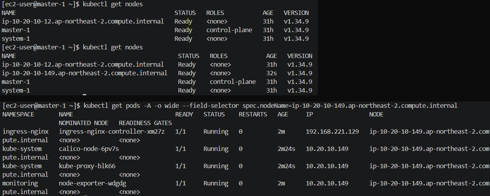

# 서강대학교 대동제 Cardinal 아키텍처 설계

> 축제 기간의 트래픽 급증을 예산 30만 원 안에서 견뎌내기 위해, 가용성·안정성·현실성을 조율한 Kubernetes 클라우드 인프라 아키텍처 설계.

멋쟁이사자처럼 서강대 × 총동아리연합회 협업 프로젝트인 **대동제 웹서비스**의 인프라 저장소입니다.
서강대생뿐 아니라 일반 사용자도 접근하는 서비스라, **제한된 예산 안에서 안정성과 비용 효율을 동시에 확보하는 것**을 목표로 했습니다.

| 구분 | 사용 기술 |
|---|---|
| **IaC** | Terraform (모듈 10개 · 로컬 state) |
| **오케스트레이션** | kubeadm `v1.34.9` · containerd · Calico |
| **AWS** | VPC · Public/Private Subnet · EC2 · ASG · EBS · ALB · Route 53 · ACM · S3 |
| **배포 · staging** | GitHub Actions → GHCR → Watchtower(단일 EC2 · Docker Compose · nginx + certbot) |
| **배포 · prod** | GitHub Actions → GHCR → ArgoCD(GitOps) · ingress-nginx · HPA + Cluster Autoscaler |
| **관측** | Prometheus · Grafana · node-exporter |

---

## 목차

1. [아키텍처 설계 구조](#1-아키텍처-설계-구조)
2. [트레이드오프](#2-트레이드오프)
3. [트러블슈팅](#3-트러블슈팅)
4. [결과 사진](#4-결과-사진)
5. [결과](#5-결과)

---

## 1. 아키텍처 설계 구조


### 출발점

이 프로젝트의 첫 목적은 Terraform과 Ansible로 쿠버네티스 클러스터를 세우는 구성을 실제 서비스에 적용해 보는 것이었습니다.

- [sohappytoday/terraform-aws](https://github.com/sohappytoday/terraform-aws) — Terraform으로 AWS 인프라 프로비저닝
- [sohappytoday/ansible](https://github.com/sohappytoday/ansible) — Ansible로 쿠버네티스 클러스터 구성

여기서 한 단계 올린 아키텍처를 이 저장소에 작성했습니다.
학습용 구성과 실제 서비스의 차이는 결국 예산·트래픽·장애라는 제약이었고, 아래 설계는 대부분 그 제약에 대한 답입니다.
특히 노드 구성은 부팅 시점에 Ansible이 개입할 수 없는 오토스케일링 환경에 맞춰, Custom AMI + 부트스트랩 자동화로 다시 짰습니다.

### 클라우드 아키텍처

**진입점을 ALB 하나로 좁혔다.**
인바운드는 ALB 80/443만 열리고, 그 뒤의 모든 노드는 Private Subnet에 있어 퍼블릭 IP가 없습니다.
TLS는 ACM 인증서로 ALB에서 종료하고 노드로는 평문 NodePort 30080으로 넘깁니다. 인증서 갱신을 클러스터가 신경 쓰지 않아도 되고,
공격 표면이 ALB 한 곳으로 모이기 때문에 방어(NACL deny · Access Log 분석)도 한 곳에서 합니다.
ALB는 생성 자체가 서로 다른 AZ의 서브넷 2개를 요구하므로 서브넷은 2 AZ로 깔되, EC2는 비용을 위해 한 AZ에 모았습니다.
ALB의 cross-zone 로드밸런싱은 기본으로 켜져 있고 무료라 다른 AZ의 ALB 노드가 타겟으로 넘겨도 추가 비용이 없습니다.

**Reverse Proxy EC2를 ALB로 바꿔 진입점의 안정성을 올렸다.**
앞선 구성(그리고 지금의 staging)에서는 nginx를 올린 EC2 한 대가 리버스 프록시 역할을 했습니다.
이 방식은 그 인스턴스가 죽으면 서비스 전체가 같이 죽고, 인증서 갱신도 노드 추가도 사람이 직접 챙겨야 합니다.
prod에서는 그 자리를 ALB로 바꿨습니다 — AWS가 관리하는 다중 AZ 구성이라 인스턴스 단위 장애가 사라지고,
TLS는 ACM으로 자동 갱신되며, 헬스체크에 실패한 노드는 자동으로 타겟에서 빠집니다.

**도메인은 Route 53을 쓸 수밖에 없었다.**
도메인은 가비아에서 샀지만 DNS는 Route 53에 있습니다. ALB는 고정 IP가 없어 A 레코드로 직접 가리킬 수 없고,
도메인 루트(`2026cardinal.com`)에 붙이려면 Alias A 레코드가 필요한데 이건 Route 53에서만 만들 수 있습니다.
그래서 Hosted Zone을 만들고 가비아 네임서버를 Route 53의 NS 4개로 바꿨습니다. ACM 인증서의 DNS 검증도 같은 Zone에서 처리됩니다.

**아웃바운드는 NAT Instance 하나로 좁혔다.**
Private 노드도 이미지 pull 같은 아웃바운드가 필요합니다. 관리형 NAT Gateway는 월 7만 원 수준이라 예산에 맞지 않아,
`source_dest_check = false` + `iptables MASQUERADE`로 직접 만든 NAT Instance를 씁니다.
1대라 SPOF가 되므로 size-1 ASG로 감싸 죽으면 자동으로 다시 뜨게 하고, S3·ECR 트래픽은 무료인 S3 Gateway Endpoint로 NAT를 우회시켰습니다.

**ASG는 정반대의 두 목적으로 썼다 — 확장, 그리고 자기 치유.**
App 노드 ASG(`min 1` / `max 3`)는 Cluster Autoscaler가 부하에 따라 크기를 바꾸는 확장용입니다.
반면 NAT를 감싼 ASG는 `min = max = 1`로 고정해 크기를 절대 바꾸지 않습니다 — 목적이 확장이 아니라 죽으면 다시 띄우는 자기 치유이기 때문입니다.
같은 리소스를 반대 의도로 쓴 셈이지만, 둘 다 목적은 하나입니다. 사람이 새벽에 깨서 인스턴스를 다시 만들지 않는 것.
ASG에 Target Group ARN을 연결해 두면 스케일아웃된 노드가 별도 작업 없이 ALB 뒤에 등록됩니다.

**관리자 경로에는 인바운드 포트를 열지 않았다.**
Control Plane에는 SSH 포트조차 없습니다. 관리자는 SSM Session Manager로 VPC Interface Endpoint를 거쳐 들어옵니다.
Bastion 인스턴스 비용과 열린 22번 포트를 동시에 없애기 위한 선택입니다.

### 리소스 아키텍처

**노드를 역할로 3등분했다.**

| 노드 | 스펙 | 올라가는 것 | 이렇게 나눈 이유 |
|---|---|---|---|
| control-plane | `t3.medium` × 1 | apiserver · etcd · scheduler · Calico | 예산상 정족수 HA를 포기한 대신, etcd 스냅샷을 S3에 정기 백업 |
| system node | `m7i-flex.large` × 1 (고정) | ArgoCD · MySQL · Redis · RabbitMQ · Prometheus · Grafana | **상태를 가진 것을 ASG 밖으로 뺐다.** ASG Scale-In과 Cluster Autoscaler는 파드를 모른 채 노드를 고르므로, MySQL이 ASG 안에 있으면 하필 그 노드가 죽을 수 있다 |
| app node | `m7i-flex.large` × ASG 1~3 | ingress-nginx(DaemonSet) · backend · frontend · metrics-server | 사용자 워크로드만 확장 대상. HPA(파드) → Cluster Autoscaler(노드) 순으로 늘어난다 |

구분은 kubelet이 등록 시 스스로 붙이는 `cardinal.io/role` 노드 라벨로 합니다.
세 모듈이 같은 키를 쓰기 때문에 node-exporter DaemonSet은 Control Plane까지 한 번에 잡고,
값이 서로 달라 Prometheus·ArgoCD·ingress의 `nodeSelector`가 다른 역할로 새어 들어가지 않습니다.

**스케일아웃 노드가 스스로 클러스터에 붙게 했다.**
ASG로 새로 뜬 EC2는 쿠버네티스가 없어 클러스터에 못 붙습니다. 부하가 몰리는 순간에 Ansible로 설치하는 건 너무 늦습니다.
그래서 kubeadm·kubelet·containerd를 미리 구운 Custom AMI를 쓰고, Control Plane이 유효한 join 커맨드를
SSM Parameter Store에 6시간마다 갱신해두면 신규 노드가 부팅하며 그것을 받아 `kubeadm join`합니다.
기본 부트스트랩 토큰 TTL이 24시간이라, 갱신이 없으면 축제 도중 스케일아웃이 조용히 실패합니다.

**ingress-nginx는 Deployment가 아니라 DaemonSet으로 띄웠다.**
ALB가 NodePort 30080으로 넘긴 요청을 받아 경로별로 서비스에 배분하는 L7 라우터입니다.
ALB는 파드가 아니라 노드 단위로 타겟을 잡기 때문에, 컨트롤러가 없는 노드가 타겟에 끼면 헬스체크에 실패하거나 노드를 한 번 더 건너뛰게 됩니다.
모든 app 노드에 하나씩 두면 ASG가 노드를 늘리는 즉시 그 노드가 정상 타겟이 됩니다.

**metrics-server는 HPA의 전제 조건이다.**
쿠버네티스는 기본적으로 파드가 CPU·메모리를 얼마나 쓰는지 모릅니다.
metrics-server가 각 kubelet에서 사용량을 모아 `metrics.k8s.io` API로 노출해야 HPA가 그 값을 읽고 레플리카 수를 정할 수 있습니다(`kubectl top`도 같은 API를 씁니다).
HPA(2~6) → Cluster Autoscaler → ASG로 이어지는 확장 사슬의 첫 단추라, 이게 없으면 뒤의 자동화가 전부 멈춥니다.

**MySQL은 RDS를 쓰지 않고 클러스터 안에 뒀다.**
RDS는 이 예산에서 가장 큰 고정비 중 하나이고 Multi-AZ를 켜면 두 배가 됩니다. 그래서 클러스터 안의 파드로 직접 운영합니다.
포기한 것은 명확합니다 — 자동 백업·페일오버·패치가 전부 사라지고, 그 자리를 mysqldump CronJob이 대신합니다.
대신 확장하지 않는 system 노드와 정적 EBS(`/mnt/data/mysql`)에 hostPath로 묶어, 오토스케일링 이벤트가 데이터에 닿지 않게 했습니다.
파드가 특정 노드에 종속되는 대가를 치르고 데이터 안전을 산 셈입니다.

**Prometheus·Grafana는 CloudWatch 대신 직접 운영한다.**
HPA가 보는 것과 같은 파드 단위 지표가 필요했고, CloudWatch Container Insights는 수집량에 비례해 요금이 붙어 예산을 예측하기 어렵습니다.
node-exporter를 DaemonSet으로 세 역할 노드 전부(toleration을 달아 Control Plane까지)에 띄우고, Grafana에서 역할별 토글로 노드·파드 CPU·메모리를 봅니다.
두 컴포넌트의 데이터는 `/mnt/data` 아래에 있어 노드를 다시 구워도 대시보드와 지표가 살아남습니다.

**staging은 쿠버네티스를 쓰지 않는다.**
예산을 아끼려고 `t3.small`(2 GiB) 한 대로 운영하는데, 이 크기에서는 kubelet과 시스템 컴포넌트가 메모리의 상당 부분을 먹습니다.
그래서 swap을 켜서 부족한 메모리를 버티기로 했고, 쿠버네티스는 kubelet이 기본적으로 swap이 켜진 노드에서 기동을 거부하므로(`failSwapOn`) 아예 Docker Compose로 갔습니다.
검증 환경에 필요한 건 성능이 아니라 "프로덕션과 같은 이미지가 일단 다 뜨는 것"이기 때문입니다.

### CI/CD 파이프라인

```
                              앱 저장소 (backend / frontend)
                                        │ push
                                        ▼
                              GitHub Actions — 빌드
                                        │
                                        ▼
                                 GHCR 이미지 푸시
                                        │
                  ┌─────────────────────┴─────────────────────┐
                  ▼                                           ▼
          staging · Watchtower                         prod · ArgoCD
       GHCR 을 30초마다 폴링해 교체            이 저장소 manifest/ 와 클러스터를 동기화
                  │                                           │
                  ▼                                           ▼
        단일 EC2 · 컨테이너 재기동                   쿠버네티스 롤링 업데이트
```

**CI는 Jenkins 대신 GitHub Actions를 썼다.**
Jenkins는 컨트롤러가 상시 떠 있어야 하고, 그 서버 비용이 그대로 예산에서 빠집니다.
빌드가 하루에 몇 번인 프로젝트에서 24시간 켜져 있는 EC2 한 대는 가장 비싼 선택이었습니다.
GitHub Actions는 러너를 GitHub가 제공하니 추가로 띄울 인프라가 없고, 소스가 이미 GitHub에 있어 웹훅이나 자격증명을 따로 이어붙일 필요도 없습니다.
운영자가 한 명인 상황에서는 관리 대상이 하나 줄어드는 것 자체가 이득입니다.

**CD는 환경에 따라 다른 방식을 썼다.**

| | staging | prod |
|---|---|---|
| 실행 환경 | 단일 EC2 · Docker Compose | 쿠버네티스 클러스터 |
| 배포 도구 | Watchtower | ArgoCD |
| 트리거 | GHCR 폴링(30초) | git 매니페스트 동기화 |
| 이미지 태그 | `staging` (가변) | `1.0.1` (고정) |
| 목적 | 즉시 반영 | 이력과 롤백 |

**staging — Watchtower가 이미지를 알아서 갈아끼운다.**
쿠버네티스가 없으니 ArgoCD를 쓸 수 없습니다. Watchtower가 30초마다 GHCR을 확인해, 라벨이 붙은 backend·frontend 컨테이너만 새 이미지로 교체하고 옛 이미지를 정리합니다.
태그가 `staging`으로 고정이라 앱 저장소에 push하면 30초 안에 올라옵니다. 검증 환경에서는 이 즉시성이 이력 추적보다 중요합니다.

**prod — ArgoCD가 git과 클러스터를 맞춘다.**
이 저장소의 `manifest/` 디렉토리가 곧 클러스터의 상태 정의이고, ArgoCD가 git과 실제 상태의 차이를 계속 비교해 맞춥니다.
사람이 `kubectl apply`를 직접 치지 않으니 누가 무엇을 바꿨는지가 git 히스토리에 남고, 급해서 손으로 고친 것도 결국 원래 정의로 되돌아옵니다.
축제처럼 여러 사람이 동시에 붙는 기간에는 이 되돌림 자체가 사고 예방입니다.
이미지 태그를 `1.0.1`처럼 고정하는 것도 같은 이유입니다. staging처럼 가변 태그를 쓰면 무엇이 언제 배포됐는지가 git에서 사라지고 롤백 기준도 없어집니다.

### 코드 구조

```
prod/
├── terraform/          # 인프라 (모듈 10개: vpc·endpoints·iam·security·nat-instance
│   ├── main.tf         #             ·control-plane·system-node·app-asg·alb·dns)
│   ├── env/prod.tfvars
│   └── modules/
└── manifest/           # 쿠버네티스 매니페스트 (노드 역할별로 디렉토리 분리)
    ├── all/            #   coredns PDB · node-exporter
    ├── app-node/       #   ingress-nginx · metrics-server · backend/frontend
    └── system-node/    #   argocd · mysql · redis · rabbitmq · prometheus-grafana
                        #   · cluster-autoscaler
staging/                # 단일 EC2 + docker compose (프로덕션과 같은 이미지로 선검증)
```

네트워크 기본 요소(VPC·서브넷·엔드포인트)는 모듈로 두고, **모듈을 가로지르는 wiring**(노드 간 SG 규칙, NAT 라우트, NACL deny 목록)은
루트 `main.tf`에 모아 연결 관계를 한 화면에서 보게 했습니다. 각 매니페스트 디렉토리의 `setup.txt`에는 적용 순서와 선행 조건을 적어 두었습니다.

---

## 2. 트레이드오프

돈이 충분하면 하지 않았을 선택들입니다. 원칙은 하나였습니다 —
**가용성에 드는 돈은 최소화하되, 데이터 손실·서비스 중단 같은 치명적인 사고는 값싼 수단으로 막는다.**

| 영역 | 정석 | 실제 선택 | 근거와 대가 |
|---|---|---|---|
| 클러스터 | EKS (월 ≈10만 원) | **kubeadm 자체 구축** | 예산 초과. 대신 컨트롤 플레인 운영 부담을 전부 떠안았다 |
| Control Plane | 3대 정족수 HA (월 ≈9만 원) | **`t3.medium` × 1** | 정족수를 포기하고 **etcd + PKI 스냅샷을 S3로 백업**해 상쇄. CP가 죽으면 제어는 멈추지만 데이터는 남는다 |
| 아웃바운드 | NAT Gateway (월 ≈7만 원) | **NAT Instance + size-1 ASG** | 대폭 절감. 자동 복구는 되지만 재생성 중 수 분간 아웃바운드가 끊긴다 |
| API 앞단 | 내부 NLB | **삭제** | CP가 1대라 로드밸런싱할 대상이 없다. 월 ≈2.5만 원 절감 |
| DB | RDS Multi-AZ | **클러스터 내 MySQL + hostPath PV** | 인프라 비용 절감. 대가는 명확하다 — 자동 백업·페일오버가 없어 mysqldump CronJob으로 직접 대체 |
| CPU 크레딧 | T 계열 기본값 `unlimited` | **`standard`로 고정** | `unlimited`는 baseline 초과분이 vCPU-시간당 **상한 없이** 과금된다. 지원금 정산에 쓸 수 없는 요금이라 "초과하면 과금" 대신 **"초과하면 쓰로틀"** 을 택했다 |
| Terraform state | S3 + DynamoDB 잠금 | **로컬 state** | 단독 운영자 1명·단일 머신 전제. 부트스트랩의 닭-달걀 문제가 사라지는 대신, state 파일 유실이 곧 추적 불가다 |
| 컴퓨팅 AZ | 2 AZ 분산 | **단일 AZ에 배치** | ALB 요구로 서브넷만 2 AZ. 진짜 AZ 장애 내성은 아직 없다(SPOF = AZ) — 남은 과제 |

---

## 3. 트러블슈팅

한 진입점을 여러 서비스가 나눠 쓰고 노드가 스스로 늘고 줄면서, 개인 프로젝트에서는 없던 문제가 나왔습니다.
멈추면 안 되는 환경이라, 넘어갈 수 있는 게 없었습니다.

### 3-1. `/grafana`로 접속했을 때 Grafana가 제대로 작동하지 않았습니다

`SUB PATH`

**시도**
Grafana는 별도 도메인을 사지 않고 서비스 도메인 아래 `/grafana` 경로에 붙이기로 했습니다.
Ingress에 rewrite 애노테이션을 걸어 `/grafana`를 떼고 넘기면 Grafana는 평소처럼 루트로 요청을 받으니 정상적으로 뜰 것이라고 생각했습니다.
실제로 첫 화면은 떴습니다.

**원인**
요청이 들어가는 방향은 실제로 맞았습니다. 문제는 나오는 방향이었습니다.
프리픽스가 떼진 URL을 받은 Grafana는 자기가 루트에 있다고 판단하고, 응답 HTML에 실어 보내는 정적 자산 경로와 리다이렉트 주소에 `/grafana`를 붙이지 않습니다.
브라우저가 그 주소를 다시 요청하면 Ingress의 `/grafana` 규칙에 걸리지 않고 `/` 규칙을 타 frontend로 넘어갔습니다.
그래서 화면 껍데기는 뜨는데 CSS와 JS가 없고, 로그인 리다이렉트는 엉뚱하게 서비스 화면으로 빠집니다.
frontend가 200을 돌려주기 때문에 404조차 나지 않아, 네트워크 탭을 열어 응답 본문을 보기 전까지는 무엇이 잘못됐는지 드러나지 않았습니다.

**해결**
오픈소스를 이용했기 때문에 이미지의 소스 코드를 수정할 수는 없었습니다.
그래서 방향을 바꿔, 프리픽스를 떼지 않고 그대로 넘긴 뒤 `root_url`과 `serve_from_sub_path`로 Grafana에게 자기 위치를 알려줬습니다.

```yaml
- name: GF_SERVER_ROOT_URL
  value: "%(protocol)s://%(domain)s/grafana/"
- name: GF_SERVER_SERVE_FROM_SUB_PATH
  value: "true"
```

응답에 싣는 주소에도 `/grafana`가 붙으니, 브라우저의 다음 요청이 Ingress 규칙으로 다시 돌아옵니다.

### 3-2. ALB 타깃 그룹에 app 노드를 등록하고 조금 있다가 서버가 자동으로 내려갔습니다

`HEALTH CHECK`

**원인**
파드도 정상이고 노드도 방금 떴는데 계속 교체되길래, 교체를 결정하는 주체인 ASG부터 봤습니다. 문제는 ASG의 헬스체크 방식에 있었습니다.
ASG에 타깃 그룹을 붙이면 헬스체크 타입이 `EC2`에서 `ELB`로 바뀝니다. 인스턴스 상태 검사에 더해 ALB 헬스체크까지 통과해야 정상으로 인정한다는 뜻입니다.
그런데 30080을 받아줄 ingress-nginx가 아직 클러스터에 없어 헬스체크는 매번 실패했고, ASG는 그 노드를 고장으로 판단해 종료하고 있었습니다.
헬스체크 유예가 300초라 정확히 5분 주기로 반복됐고, `desired_capacity`가 1이라 교체되는 동안에는 app 노드가 0대가 됐습니다.

**고민**
헬스체크 유예 시간을 늘리거나 판정을 느슨하게 잡을 수도 있었습니다. 그러면 당장 교체는 멈춥니다.
하지만 그건 축제 기간에 진짜 고장난 노드까지 살려두게 되는 설정입니다. 노드를 갈아끼우라고 만든 기능의 기준을 무디게 만드는 셈이라 택하지 않았습니다.
판정 기준이 아니라 순서가 문제였습니다. 아직 응답할 수 있는 것이 없는데 응답을 요구받고 있었습니다.

**해결**
타깃 그룹 등록을 `register_app_nodes_to_alb` 변수로 분리해 뒤로 미뤘습니다.
ALB 헬스체크가 걸리지 않은 상태로 클러스터를 먼저 띄우고, ingress-nginx가 30080을 열고 응답하는 것을 확인한 뒤 변수를 켜 타깃 그룹에 등록했습니다.
등록은 ASG in-place 업데이트라 이미 떠 있는 노드가 교체되지 않습니다.

### 3-3. Ansible을 이용해서 쿠버네티스 클러스터를 구축할 수 없었습니다

`PROVISIONING`

**원인**
개인 프로젝트에서 만들었던 Ansible 기반 클러스터 구축의 한계점이 드러났습니다.
Ansible은 대상 호스트가 이미 있고 실행 시점을 사람이 정할 수 있을 때 성립하는 도구입니다.
그런데 ASG는 부하에 따라 노드 수가 변하기 때문에, 사람이나 cron으로 실행하기에는 시점을 예측할 수 없었습니다.
또한 사람이 직접 부트스트랩하는 것보다는 Ansible로 설치하는 편이 빠르지만, ASG가 노드를 늘리는 급박한 상황에서는 그보다 더 빠른 기동이 필요했습니다.
스케일아웃은 이미 부하가 몰린 뒤에 일어나므로, 패키지 설치부터 시작하는 몇 분이 그대로 지연으로 남습니다.

**해결**
EC2가 생성됨과 동시에 워커 노드로 등록시킬 방법을 찾은 결과, Amazon Linux에 쿠버네티스가 이미 설치된 Custom AMI를 만들기로 했습니다.
kubeadm·kubelet·containerd와 필요한 이미지를 미리 구워 두고, 부트 스크립트에서 워커 노드 연결까지 수행하도록 해, 인스턴스가 뜨면 클러스터에 자동으로 붙고 등록되는 시간을 대폭 낮췄습니다.
남은 조각은 join 토큰이었습니다. 기본 부트스트랩 토큰은 24시간 뒤 만료돼 축제 도중 스케일아웃이 조용히 실패할 수 있습니다.
그래서 컨트롤 플레인이 유효한 join 커맨드를 SSM Parameter Store에 6시간마다 갱신해 두고, 새 노드가 부팅하며 그 값을 받아 쓰도록 했습니다.

**결과**

세 단계에 걸쳐 줄여온 문제입니다. 각 단계는 앞 단계의 한계를 넘기 위해 나온 선택이었습니다.

| 단계 | 방식 | 노드 1대를 클러스터에 투입하기까지 | 수동 대비 |
|---|---|---|---|
| 1 | 수동 부트스트랩 | 약 1시간 (3,600초) | — |
| 2 | Ansible 플레이북 <br/>*(이전 개인 프로젝트)* | 약 5분 (300초) | **−91.7%** |
| 3 | **Custom AMI + SSM join** <br/>***(이번 프로젝트)*** | **56초** | **−98.4%** |

Ansible이 수동 설치를 91.7% 줄여줬지만, ASG 앞에서는 그 5분조차 길었습니다.
실행 시점을 사람이 정해야 한다는 전제가 오토스케일링과 맞지 않았고, 스케일아웃은
이미 부하가 몰린 뒤에 일어나므로 패키지 설치에 쓰는 몇 분이 그대로 지연으로 남기 때문입니다.
Custom AMI는 그 5분을 다시 **81.3%** 줄여 56초로 만들었습니다.

> 1·2단계는 이전 개인 프로젝트에서의 경험치이고, 56초는 이번 클러스터에서 ASG `desired_capacity`를
> 1 → 2로 올려 실측한 값입니다(EC2 `LaunchTime` → 노드 `Ready` 조건 전이 시각).

### 3-4. 카카오 로그인이 되지 않았습니다

`AUTH`

**증상**
로그인 버튼을 누르면 카카오 동의 화면까지는 갑니다. 그런데 돌아오면 로그인이 되어 있지 않았습니다.
화면에는 아무 에러도 뜨지 않고, 백엔드 로그에도 예외가 남지 않습니다. 손에 쥔 단서는 카카오가 돌려준 `KOE010` 코드 하나뿐이었습니다.

**시도**
문서상 `KOE010`은 클라이언트 인증 실패입니다. 값이 틀렸거나 인증 방식이 안 맞거나 둘 중 하나인데,
값은 카카오 콘솔에서 복사해 넣은 것이라 틀렸을 리 없다고 보고 인증 방식부터 팠습니다.
실제로 맞지 않는 부분이 있었습니다. Spring Security의 기본값은 자격증명을 `Authorization` 헤더에 담는 `client_secret_basic`인데,
카카오는 요청 바디에 담는 `client_secret_post`만 받습니다.
그래서 인증 방식을 바꿨는데 이번에는 설정이 반영되지 않았습니다.
환경변수 이름으로 준 `client-authentication-method`를 Spring의 relaxed binding이 복원하지 못한 것이라,
`SPRING_APPLICATION_JSON`으로 JSON 트리를 통째로 주입해서야 적용됐습니다.
그런데도 `KOE010`은 그대로였습니다.

**원인**
남은 가능성은 값 자체였습니다. Secret을 만들 때 셸에 값을 붙여 넣고 **엔터를 쳤는데, 그 엔터가 개행 문자로 값 끝에 같이 저장돼 있었습니다.**
카카오 입장에서는 한 글자가 더 붙은 다른 시크릿이니 인증이 실패하는 게 당연했습니다.
이걸 늦게 찾은 데는 이유가 있습니다. 셸에서 `${#SECRET}`으로 길이를 재면 명령 치환이 끝의 개행을 잘라내기 때문에 정상 길이가 나옵니다.
눈으로 봐도, 길이를 세어 봐도 멀쩡한 값이었습니다. `wc -c`로 바이트를 직접 세고 나서야 한 글자가 더 있다는 게 드러났습니다.

**해결**
`printf '%s'`로 개행 없이 Secret을 다시 만들고, 검증 절차를 `${#VAR}`가 아니라 `wc -c`로 바꿨습니다.
비밀번호에 `!`가 들어가면 bash 히스토리 확장이 값을 조용히 바꾸므로 항상 작은따옴표로 감싸는 것도 같은 이유로 규칙에 넣었습니다.

한 가지 덧붙이면, 원인을 찾는 동안 손댄 두 가지도 결국 로그인에 필요한 설정이었습니다.
하나는 프로토콜입니다. ALB가 TLS를 종료하고 노드에는 평문을 넘기는데 ingress-nginx가 기본적으로 `X-Forwarded-Proto: https`를 자기가 본 `http`로 덮어써서,
백엔드가 자기 주소를 `http://`로 오해하고 리다이렉트 URI 불일치(`KOE006`)를 만들었습니다. 컨트롤러에 `use-forwarded-headers`를 켜서 해결했습니다.
다른 하나는 세션입니다. ingress-nginx가 DaemonSet이고 백엔드가 여러 레플리카라 인가 요청과 콜백이 서로 다른 파드에 도착했고,
인가 상태를 가진 파드가 아닌 곳으로 콜백이 가면 로그인은 성공해도 세션이 남지 않았습니다. 쿠키 어피니티(`affinity: cookie`)로 같은 파드에 묶었습니다.

**남은 것**
셸을 거쳐 만든 Secret은 눈으로 검증되지 않는다는 것. 이후로 Secret은 만들 때마다 `wc -c`로 바이트를 세고 넘어갑니다.

---

## 4. 결과 사진

<!-- 아래 파일들을 docs/ 에 넣으면 자동으로 표시됩니다 -->

### 서비스


### Grafana 대시보드


### ArgoCD


### 클러스터 상태


### 오토스케일링 — 노드 증설

ASG의 `desired_capacity`를 1 → 2로 올렸을 때입니다. 새 인스턴스가 부팅과 동시에
SSM Parameter Store에서 join 커맨드를 받아 스스로 `kubeadm join`하고, 곧바로
DaemonSet(`calico-node`·`kube-proxy`·`node-exporter`)과 `ingress-nginx`가 배치됩니다.
kubelet·containerd·Calico가 Custom AMI에 미리 구워져 있어 부팅 후에는 join만 하면 됩니다.
**EC2 부팅(`13:22:10Z`)부터 노드 `Ready`(`13:23:06Z`)까지 56초**가 걸렸습니다.



---

## 5. 결과

**숫자로 본 결과**

| 지표 | 값 |
|---|---|
| 노드 합류 시간 (EC2 부팅 → `Ready`) | **56초** — 수동 대비 **−98.4%**, Ansible 대비 **−81.3%** |
| 열린 인바운드 포트 | **0개** |
| Terraform 모듈 | **10개** |
| 오토스케일 범위 | 파드 HPA `2~6` / 노드 ASG `1~3` |

**만든 것**

- Terraform `apply` 한 번으로 VPC부터 ALB까지 서는 인프라 (모듈 10개, 로컬 state)
- 노드가 부팅과 동시에 스스로 클러스터에 join하는 kubeadm 클러스터 (Custom AMI + SSM Parameter Store 토큰 배포)
- `https://2026cardinal.com` — Route 53 + ACM 인증서로 HTTPS 종료, ALB 단일 진입점
- 파드(HPA `2~6`) → 노드(ASG `1~3`) 2단 오토스케일링
- ArgoCD 기반 GitOps 배포 파이프라인과, Prometheus·Grafana 노드/파드 리소스 대시보드
- etcd + PKI 스냅샷 S3 일일 백업 및 수동 복구 스크립트

**설계 원칙이 실제로 지켜졌는가**

- 인바운드 진입점은 ALB 하나, 아웃바운드는 NAT 하나, 관리자 경로는 SSM 하나 — **열린 인바운드 포트 0개**로 클러스터를 운영
- 상태를 가진 워크로드(MySQL·Prometheus·Grafana)는 ASG 밖 고정 노드와 정적 EBS에 격리해, 오토스케일링이 데이터에 닿지 않음
- 관리형 서비스(EKS·NAT Gateway·RDS·NLB)를 전부 대체해 월 고정비를 예산 안으로 맞춤

**남은 과제**

- **진짜 Multi-AZ HA** — 현재 컴퓨팅은 단일 AZ라 AZ 장애 내성이 없습니다
- **Control Plane HA** — 예산 여유가 생기면 3대 정족수로 복원
- **DB 이중화** — 현재 단일 MySQL. 중요도가 오르면 RDS Multi-AZ 또는 클러스터 내 복제
- **관측성 확장** — Loki 로그 수집과 알람 라우팅
